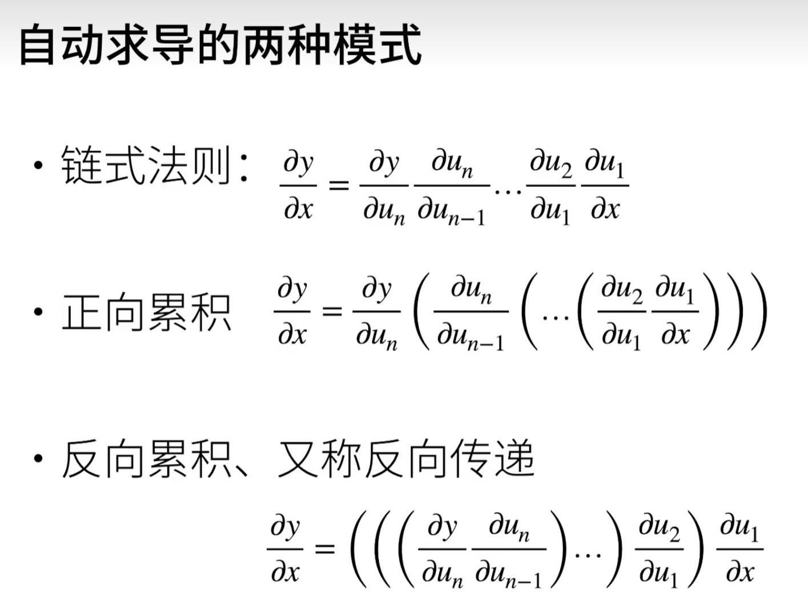

深度学习日志    
Ai地图 

torch.arange(12).reshape(3,4)   
矩阵运算    
dot\mv\mm   
函数求导
| 分子 \ 分母 | 标量 $x$ | 列向量 $\boldsymbol{x}(n,1)$ | 矩阵 $\boldsymbol{X}(n,k)$ |
| ---- | ---- | ---- | ---- |
| 标量 $y$ | $\displaystyle \frac{\partial y}{\partial x}\;(1,)$ | $\displaystyle \frac{\partial y}{\partial \boldsymbol{x}}\;(1,n)$ | $\displaystyle \frac{\partial y}{\partial \boldsymbol{X}}\;(k,n)$ |
| 列向量 $\boldsymbol{y}(m,1)$ | $\displaystyle \frac{\partial \boldsymbol{y}}{\partial x}\;(m,1)$ | $\displaystyle \frac{\partial \boldsymbol{y}}{\partial \boldsymbol{x}}\;(m,n)$ | $\displaystyle \frac{\partial \boldsymbol{y}}{\partial \boldsymbol{X}}\;(m,k,n)$ |
| 矩阵 $\boldsymbol{Y}(m,l)$ | $\displaystyle \frac{\partial \boldsymbol{Y}}{\partial x}\;(m,l)$ | $\displaystyle \frac{\partial \boldsymbol{Y}}{\partial \boldsymbol{x}}\;(m,l,n)$ | $\displaystyle \frac{\partial \boldsymbol{Y}}{\partial \boldsymbol{X}}\;(m,l,k,n)$ |

对标量进行求导数原本维度不变，对向量或者矩阵进行求导是一次升dimension   
链式法则    
    
自动求导    
    
# 计算图
from mxnet import sym
a=sym.var()
b=sym.var()
c=2*a+b

人生的容错很大，一件事情没有绝对的正确或错误。
信心：如果在做一件事的时候就开始怀疑这件事的意义，那就先停下吧。

